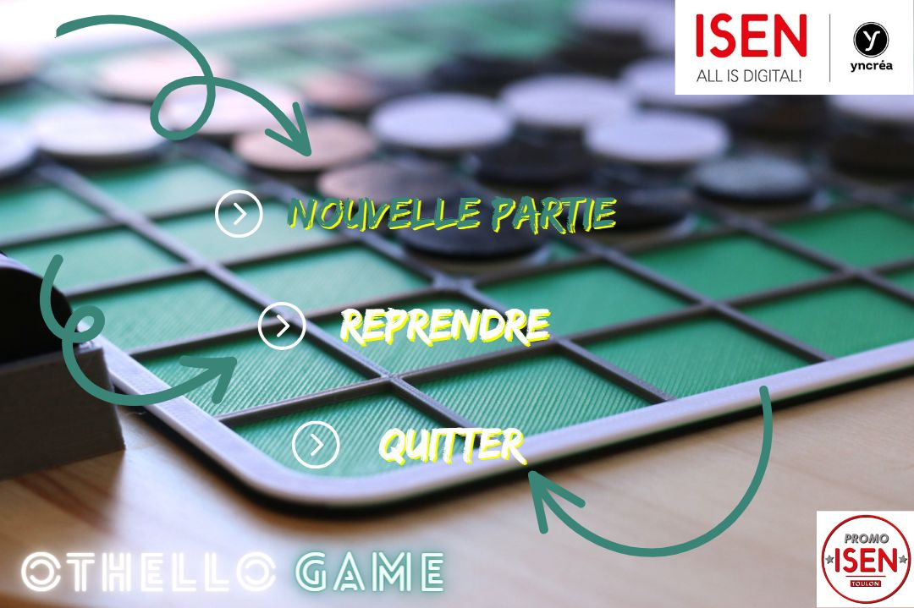

    
# Othello_Game
Ce projet est une implémentation du jeu Othello (aussi connu sous le nom de Reversi) en C, conçu pour être exécuté sous un environnement Linux. Le jeu est développé en utilisant la bibliothèque SDL pour les graphiques. 
=======

Prérequis

Assurez-vous d'avoir les éléments suivants installés sur votre système :

    GCC : Le compilateur C pour la compilation du code.
    Git : Pour cloner le référentiel depuis GitHub.
    SDL (Important) : Bibliothèque utilisée pour les fonctionnalités graphiques.

Téléchargement

    git clone https://github.com/votreutilisateur/othello-game-c.git

    cd othello-game-c

Compilation

    gcc -o othello main.c -lSDL -lSDL_image -lSDL_ttf
ou

    make

Exécution

    ./othello
ou

    ./main

Options de Jeu

    Suivez les instructions affichées à l'écran pour jouer au jeu Othello.
    Utilisez les commandes spécifiées pour effectuer vos mouvements.

Fonctionnalités

    Console : Le jeu est conçu pour être joué en mode console.
    Graphiques (optionnel) : Si la bibliothèque SDL2 est installée, le jeu peut inclure des fonctionnalités graphiques.

Remarques

    Assurez-vous de compiler avec la bibliothèque mathématique si nécessaire (-lm).
    Pour les fonctionnalités graphiques, assurez-vous d'avoir SDL2 installé sur votre système.

Contributeurs

    -Level sony
    -kevin takam
    -zachee njila

Licence

Ce projet est sous licence MIT.

Remarques :

1)	Si vous souhaitez ouvrir le projet directement avec un IDE, assurez-vous de configurer votre éditeur pour prendre en compte les bibliothèques utilisées (SDL, SDL_image, SDL_ttf).

2)	L’exécutable du jeu n’est pas mentionné ici, car il est compilé à partir de tous les fichiers .h et .c. Vous pouvez l’exécuter à partir du makefile pour jouer directement ou pour visualiser le résultat final.

3)	Le jeu propose deux modes : joueur contre joueur et joueur contre ordinateur. Dans le mode joueur contre ordinateur, On a développé deux algorithmes (bot_facile et bot_moyen) qui simulent un joueur débutant et un joueur amateur.Vous pouvez développer votre propre algorithme pour simuler un joueur Difficile.

4)	Les images utilisées dans le jeu ont été créées manuellement, mais vous pouvez les modifier pour améliorer l’apparence du jeu. Vous pouvez également ajouter des effets sonores.

5)	Je suis convaincu que ces algorithmes peuvent être implémentés de manière plus optimale. N’hésitez pas à me contacter par e-mail à <sony-dilane-level.mbango@isen.yncrea.fr> 

